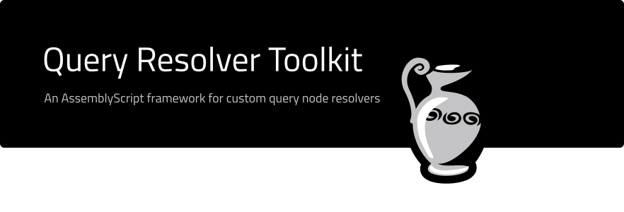

This is the work-in-progress version of an AssemblyScript framework for creating custom query resolvers for the [query node](https://github.com/Joystream/query-node-joystream). 

It features three components:

- The toolkit (`src/lib/joystream/query`)
- A reference application (`src/reference`)
- Unit tests (`src/__tests__`)


# Work in progress

The query node is in a very early stage of development, and it may remain unstable for some time. 

# Building the reference query resolver runtime

## Requirements

### Yarn

This project uses [yarn](https://yarnpkg.com/) as Node package manager. It also
uses some node packages with native components, so make sure to install your
system's basic build tools.

On Debian-based systems:

```bash
$ apt install build-essential
```

On Mac OS (using [homebrew](https://brew.sh/)):

```bash
$ brew install libtool automake autoconf
```

## Setting up

```bash
$ yarn install
```

## Build

```bash
$ yarn run build
```

## Build and and watch for changes

```bash
$ yarn run watch
```
